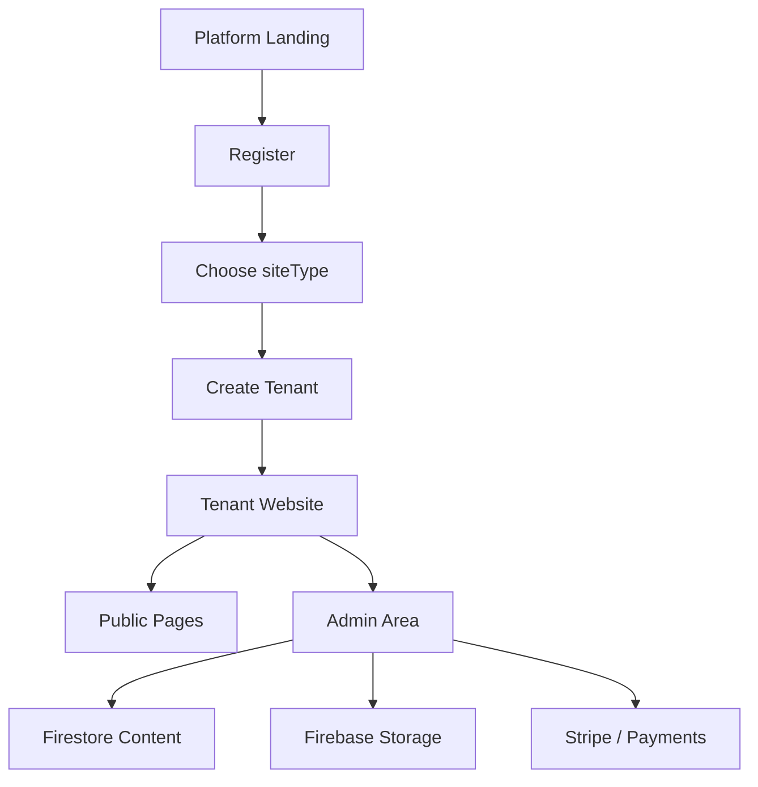

<div dir="rtl" align="right">

# genisite

פלטפורמה רב־ארגונית ליצירת אתרים לעמותות, ישיבות, בתי כנסת וארגונים.  
המערכת מאפשרת להקים אתר פעיל עם עיצוב אחיד, ניהול תוכן, תשלומים, קמפיינים, גלריה, יצירת קשר והרשאות מנהל, בלי לפתח אתר חדש לכל לקוח מאפס.

[https://www.genisite.com](https://www.genisite.com)

---

## מה זה genisite

`genisite` היא אפליקציית Multi-Tenant: קוד אחד, תשתית אחת, והרבה אתרים נפרדים לפי סוג ארגון וכתובת.

כל אתר מקבל נתיב ציבורי משלו:

</div>

```text
/beit-knesset/:slug
/amuta/:slug
/yeshiva/:slug
/organization/:slug
```

<div dir="rtl" align="right">

לדוגמה:

</div>

```text
https://www.genisite.com/amuta/hasdei-david
https://www.genisite.com/yeshiva/or-hatorah
https://www.genisite.com/beit-knesset/shaarei-tefila
```

<div dir="rtl" align="right">

בית כנסת נשאר תבנית ברירת המחדל, כדי לשמור תאימות מלאה לאתרים קיימים.

---

## יכולות מרכזיות

- יצירת אתר חדש לפי סוג ארגון: בית כנסת, עמותה, ישיבה או ארגון כללי.
- התאמת טקסטים, ניווט ומודולים לפי סוג האתר.
- ניהול תוכן מלא דרך אזור מנהל.
- הודעות ועדכונים.
- גלריית תמונות.
- עמוד יצירת קשר עם טופס, מפה, וואטסאפ וקישור לקבוצה.
- תשלומים ותרומות.
- קמפיינים להתרמות עם קישורים אישיים למתרימים.
- ניהול חשבונות וחיובים.
- תמיכה בסליקת אשראי דרך Stripe.
- תמיכה ב־Firebase Auth, Firestore, Storage ו־Functions.
- תמיכה מלאה בעברית ו־RTL.
- בדיקות E2E עם Playwright.

---

## סוגי אתרים נתמכים

| סוג | נתיב | שימושים עיקריים |
|---|---|---|
| בית כנסת | `/beit-knesset/:slug` | זמני תפילות, הודעות, תשלומים, גלריה, ברכות, קמפיינים |
| עמותה | `/amuta/:slug` | תרומות, פרויקטים, פעילות, שקיפות, מתנדבים, קמפיינים |
| ישיבה | `/yeshiva/:slug` | סדרי לימוד, שיעורים, צוות רבנים, הרשמה, תרומות |
| ארגון | `/organization/:slug` | פעילות, שירותים, צוות, חדשות, יצירת קשר |

---

## Stack טכנולוגי

| שכבה | טכנולוגיה |
|---|---|
| Frontend | React 18, Vite, MUI 5 |
| Routing | React Router |
| Styling | MUI Theme, CSS Modules, RTL |
| Auth | Firebase Auth |
| Database | Firestore |
| Storage | Firebase Storage |
| Serverless | Firebase Functions |
| Hosting | Firebase Hosting |
| Payments | Stripe |
| Emails | EmailJS / Stripe receipts |
| Tests | Playwright |

---

## ארכיטקטורה

המערכת בנויה סביב tenant יחיד לכל אתר. כל tenant מחזיק את ההגדרות, התוכן, סוג האתר, פרטי קשר, תשלומים, תמונות, קמפיינים והרשאות.

</div>



<div dir="rtl" align="right">

מבנה Tenant בסיסי:

</div>

```js
{
  siteType: 'beit-knesset' | 'amuta' | 'yeshiva' | 'organization',
  templateId: 'beit-knesset',
  name: 'שם האתר',
  subtitle: 'כותרת משנה',
  contact: {},
  payments: {},
  theme: {},
  images: [],
  content: {},
  admins: []
}
```

<div dir="rtl" align="right">

---

## מבנה נתיבים

### נתיבי הפלטפורמה

| נתיב | תיאור |
|---|---|
| `/` | דף הבית של הפלטפורמה |
| `/register` | יצירת אתר חדש |
| `/features` | יכולות המערכת |
| `/pricing` | מחירים |
| `/faq` | שאלות נפוצות |
| `/contact-us` | יצירת קשר עם הפלטפורמה |
| `/login` | התחברות מנהלים |

### נתיבי אתר לקוח

| נתיב | תיאור |
|---|---|
| `/:siteType/:slug` | דף הבית של האתר |
| `/:siteType/:slug/hodaot` | הודעות ועדכונים |
| `/:siteType/:slug/tashlumim` | תשלומים ותרומות |
| `/:siteType/:slug/campaigns` | קמפיינים |
| `/:siteType/:slug/galeria` | גלריה |
| `/:siteType/:slug/contact` | יצירת קשר |
| `/:siteType/:slug/admin` | ניהול האתר |
| `/:siteType/:slug/activate` | הפעלת האתר |

---

## מבנה תיקיות מרכזי

</div>

```text
src/
  components/          רכיבי UI משותפים
  config/              הגדרות tenants, סוגי אתרים ו־theme
  pages/               עמודי הפלטפורמה והאתרים
  pages/admin/         טאבים ורכיבים של אזור הניהול
  pages/register/      תהליך יצירת אתר
  utils/               פונקציות עזר, slug, payments, formatters
functions/
  index.js             Firebase Functions ו־Stripe endpoints
public/images/         נכסים סטטיים
tests/e2e/             בדיקות Playwright
```

<div dir="rtl" align="right">

---

## התקנה מקומית

דרישות:

- Node.js 18 ומעלה
- npm
- Firebase project
- Stripe account עבור סליקה מלאה

התקנה:

</div>

```bash
npm install
cp .env.example .env
npm run dev
```

<div dir="rtl" align="right">

ברירת המחדל המקומית:

</div>

```text
http://localhost:5173
```

<div dir="rtl" align="right">

---

## משתני סביבה

קובץ דוגמה נמצא ב־`.env.example`.

משתנים מרכזיים:

</div>

```bash
VITE_FIREBASE_API_KEY=
VITE_FIREBASE_AUTH_DOMAIN=
VITE_FIREBASE_PROJECT_ID=
VITE_FIREBASE_STORAGE_BUCKET=
VITE_FIREBASE_MESSAGING_SENDER_ID=
VITE_FIREBASE_APP_ID=
VITE_FIREBASE_FUNCTIONS_REGION=
VITE_PUBLIC_SITE_URL=
VITE_PLATFORM_ADMIN_EMAILS=
VITE_STRIPE_PUBLIC_KEY=
VITE_ENABLE_AUTOMATIC_CHECKOUT=
```

<div dir="rtl" align="right">

סודות Stripe לא נשמרים ב־`.env` ולא נכנסים ל־Git. יש להגדיר אותם דרך Firebase Secret Manager:

</div>

```bash
firebase functions:secrets:set STRIPE_SECRET_KEY
firebase functions:secrets:set STRIPE_WEBHOOK_SECRET
```

<div dir="rtl" align="right">

---

## פיתוח

הרצת סביבת פיתוח:

</div>

```bash
npm run dev
```

<div dir="rtl" align="right">

בניית production:

</div>

```bash
npm run build
```

<div dir="rtl" align="right">

תצוגה מקומית של build:

</div>

```bash
npm run preview
```

<div dir="rtl" align="right">

---

## בדיקות

פקודות מומלצות לפני merge או deploy:

</div>

```bash
npm audit --audit-level=moderate
npm audit --prefix functions --audit-level=moderate
node --check functions/index.js
npm run build
npm run test:e2e
```

<div dir="rtl" align="right">

בדיקות E2E רצות עם Playwright ומכסות זרימות מרכזיות כמו יצירת אתר, התאמת סוג אתר, ניתוב tenant ותצוגת עמודים.

---

## Firebase

קבצי Firebase בפרויקט:

- `firebase.json`
- `.firebaserc`
- `firestore.rules`
- `storage.rules`
- `firestore.indexes.json`
- `functions/index.js`

פריסת Hosting:

</div>

```bash
npm run build
npx firebase-tools deploy --only hosting --project genisite-platform
```

<div dir="rtl" align="right">

פריסת Rules ו־Indexes:

</div>

```bash
npx firebase-tools deploy --only firestore:rules,firestore:indexes,storage --project genisite-platform
```

<div dir="rtl" align="right">

פריסת Functions:

</div>

```bash
npx firebase-tools deploy --only functions --project genisite-platform
```

<div dir="rtl" align="right">

להוראות פריסה מלאות ראו:

[DEPLOYMENT.md](DEPLOYMENT.md)

---

## Stripe ותשלומים

המערכת תומכת בשני שימושים מרכזיים:

- הפעלת אתר בתשלום דרך Checkout.
- תרומות וקמפיינים דרך PaymentIntent.

Webhook מומלץ:

</div>

```text
https://YOUR_DOMAIN/stripeWebhook
```

<div dir="rtl" align="right">

אירועים נדרשים:

- `checkout.session.completed`
- `checkout.session.expired`
- `payment_intent.succeeded`

---

## עקרונות מוצר ועיצוב

- כל האתר מותאם RTL.
- העיצוב נשאר יוקרתי, נקי ושמרני: נייבי, זהב, טיפוגרפיה ברורה וקומפוזיציה שקטה.
- בית כנסת נשמר כ־template המקורי והיציב.
- כל סוג אתר מקבל טקסטים, ניווט ומודולים רלוונטיים בלבד.
- אין לפגוע ב־tenant קיים שאין לו `siteType`; ברירת המחדל היא `beit-knesset`.

---

## Workflow Git

העבודה הנוכחית מתבצעת על branch:

</div>

```text
feature/multi-organization-platform
```

<div dir="rtl" align="right">

כלל עבודה:

- לא ממזגים ל־`main` בלי אישור מפורש.
- כל שינוי משמעותי צריך לעבור build.
- שינויי UI משמעותיים צריכים להיבדק בדפדפן בדסקטופ ובמובייל.

---

## סטטוס

הפרויקט נמצא בפיתוח פעיל.  
האתר החי רץ על Firebase Hosting תחת:

[https://www.genisite.com](https://www.genisite.com)

</div>
